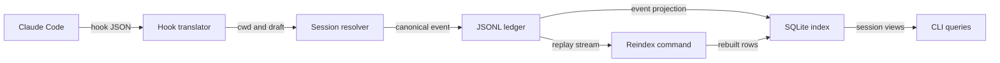

# Dispatch

Dispatch is a local control plane for agentic work sessions. It creates an isolated Git
worktree, assigns it a durable session identity, records structured agent events in an
append-only JSONL ledger, and derives fast session views in SQLite.

This repository implements the Stage 0 command surface from [`arch.md`](arch.md):
create, list, log, merge, remove, reindex, and Claude Code hook ingestion. The complete
local lifecycle is executable and tested. Release qualification still requires Bun
`1.3.14` on a supported macOS/Linux target and a live Claude Code invocation; the local
verification host is Windows with Bun `1.3.6`.

Tmux orchestration, copy-on-write dependency provisioning, review handoff, and batch
execution remain later stages with explicit gates; they are not represented as finished.

## Requirements

- Bun `1.3.14` (repository-pinned)
- Git on `PATH`
- macOS or Linux for the supported v1 target
- tmux only for the unimplemented Stage 1

Windows remains unsupported as a product target. The test suite runs on Windows to catch
path and process-boundary defects, but that is not a support claim.

## Verify and build

```sh
bun install --frozen-lockfile
bun run check
bun run build
```

`bun run check` runs strict TypeScript checking, the core import-boundary check, and all
unit, contract, and integration tests. `bun run build` compiles the host `dsp` binary
with bytecode. The release matrix is available separately:

```sh
bun run build:matrix
```

That command targets macOS and Linux on arm64 and x64 and may download target Bun
runtimes.

## First session

Run from a clean Git repository on a local branch with at least one commit:

```sh
bun run dsp doctor
bun run dsp new auth-refactor
bun run dsp ls
```

`dsp new` prints the session ID and worktree path. Work in that path, commit the result,
then merge through Dispatch while the primary repository is clean and still on the
recorded base branch:

```sh
bun run dsp log <sid>
bun run dsp merge <sid>
bun run dsp remove <sid>
```

`merge` rejects uncommitted session work, then records the committed session diffstat,
wall duration, observed turn count, and observed cost before closing the session.
`remove` refuses dirty worktrees unless `--force` is explicit; a forced dirty removal is
recorded as `git.discarded`, even if an earlier merge outcome exists.

## Claude Code hooks

Install structured hooks at Claude user scope:

```sh
bun run dsp hooks install claude
```

The default installer updates `~/.claude/settings.json` idempotently and preserves
existing settings. User scope is deliberate: future Dispatch worktrees inherit the hook
without per-worktree setup. The hook resolves cwd against Dispatch session metadata and
returns without recording anything outside a Dispatch-owned worktree.

To constrain installation to one existing project:

```sh
bun run dsp hooks install claude --project /path/to/repository
```

Explicit project scope writes `/path/to/repository/.claude/settings.local.json`. It is
project-local only and is **not inherited by future Dispatch worktrees**.

A compiled installation uses `dsp hook claude`; when testing from source, pass an installed
wrapper or explicit executable path through `--command`.

This answers how a Claude hook becomes durable query state:



The translator records provider correlation fields under `ext.claude`. It does not store
prompt bodies, command bodies, tool responses, assistant messages, or transcript
contents. Unknown future payloads retain field names and value types only, never unknown
values.

## State and configuration

Authoritative state follows XDG paths:

```text
$XDG_STATE_HOME/dispatch/
├── machine-id
├── index.sqlite                 derived and disposable
└── sessions/
    └── <sid>/
        ├── meta.json            immutable, ledger-rebuildable facts projection
        └── events.jsonl         authoritative append-only ledger
```

For isolated development and tests, `DISPATCH_HOME` overrides the Dispatch state
directory. `DISPATCH_WORKTREE_ROOT` and `DISPATCH_BRANCH_PREFIX` override their
configuration values.

Global configuration is `$XDG_CONFIG_HOME/dispatch/config.toml`; a repository may
override it with `.dispatch.toml`:

```toml
[worktrees]
root = "~/.local/share/dispatch/worktrees"
branch_prefix = "dispatch/"

[ledger]
fsync = true
lock_timeout_ms = 2000
```

Configuration is strict: unknown keys fail instead of silently accepting typos.

## Repository map

This answers where each Stage 0 responsibility lives:

```text
src/
  core/
    identity/              sortable session and event IDs
    ledger/                canonical schema, locking, append, replay
    index/                 disposable SQLite projection
    worktree/              argv-safe Git lifecycle and diffstat
    config/                strict TOML overlay
    paths/                 XDG state and machine identity
  application/             lifecycle orchestration across core boundaries
  adapters/hooks/          provider translators and hook settings
  ports/                   provider-neutral agent contract
  cli/                     human command surface and lazy router
  hook/                    minimal provider-facing process entry
scripts/                   build, boundary, and reflink probe commands
test/
  unit/                    deterministic core and CLI tests
  contract/                fixture-backed provider adapter contract
  integration/             real Git worktree lifecycle
skills/dispatch-history/   agent-facing history query procedure
docs/decisions/            implementation ADRs
arch.md                    architecture specification v0.2
```

## Stage boundaries

- Stage 0 command surface: implemented and locally verified on the unsupported Windows
  compatibility host. Supported-target and live-provider qualification remain open.
- Stage 1: tmux orchestration is not implemented or dogfooded.
- Stage 2: only the filesystem probe harness exists; no provisioning engine ships before
  the O3 divergence-safety spike.
- Stage 3: merge outcomes and a basic history skill exist; review handoff and richer
  cross-session queries do not.
- Stages 4–5: batch execution and additional providers are not implemented.

The architecture’s strongest alternative is a ledger-only companion beside workmux. It
remains the required pivot if Stage 1 fails to displace workmux in two weeks of actual
use.

## Known release gates

- Git lifecycle effects and ledger receipts are not one atomic transaction. Worktree
  creation records durable intent before invoking Git; merge and remove are idempotently
  retryable after common post-effect failures. Automatic startup reconciliation is not
  implemented, so an interrupted operation may still require rerunning the same command.
  An origin-only create intent remains visible in `dsp ls` and can be terminally closed
  with `dsp remove <sid>`; resuming that same creation intent is not implemented.
- Provider hooks are recorded at least once. Provider correlation identifiers are
  retained for diagnosis, but cross-process semantic deduplication is not implemented.
- The `<5 ms` hook-append and `<50 ms` 500-session query targets in `arch.md` are
  unverified on supported targets.
- The CI workflow and four-target build matrix are configured, not evidence that those
  remote jobs or artifacts have run.
- A real Claude Code process must confirm that the user-scope hook resolves and appends
  in a generated worktree. The suite exercises the identical executable stdin path with
  fixture payloads, but not Claude itself.
