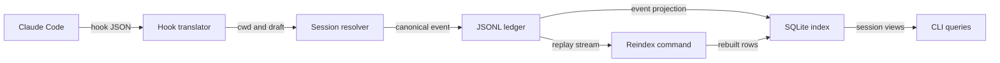

# Dispatch

Dispatch is a local control plane for agentic work sessions. It creates an isolated Git
worktree, assigns it a durable session identity, records structured agent events in an
append-only JSONL ledger, and derives fast session views in SQLite.

This repository implements the Stage 0 command surface from [`arch.md`](arch.md):
create, list, log, merge, remove, reindex, and Claude Code hook ingestion. The complete
local lifecycle is executable and tested. The pinned Bun `1.3.14` source suite and
compiled lifecycle pass locally on native Windows x64, the primary v1 target. Remote
Windows CI and a real Claude Code invocation have both passed. Stage 0 remains a
prerelease because its original process-level latency targets were measured and missed;
the evidence and release verdict are retained under [`docs/qualification`](docs/qualification/README.md).

The [`v0.2.0-alpha.2` prerelease](https://github.com/smithdak/dispatch/releases/tag/v0.2.0-alpha.2)
extends the first Stage 1 native Windows slice with an explicit Herdr server namespace,
conservative alpha.1 receipt migration, and authorized cold-restart recovery. The exact
Windows artifact from main commit `43fb976` passed five isolated stop/start cycles:
Herdr restored the workspace/tab/pane/cwd shape, Dispatch durably linked each replacement
terminal generation before reuse, and a fresh command ran after every restart. This
remains an alpha slice: private prompt delivery, layouts, concurrent mutation stress,
native agent-conversation restore, and sustained daily use remain open.

The current source candidate adds private, stdin-only prompt submission over Herdr's
Windows named pipe. It has source-level tests but is not part of alpha.2 and is not a
release-qualified claim until a compiled Windows artifact passes the dedicated prompt
profile.

## Requirements

- Windows x64 (primary v1 target) or Linux x64 (secondary target)
- Git on `PATH`
- Bun `1.3.14` for source development and release builds; legacy `1.3.6` is also locally
  qualified with a doctor warning. Other Bun versions fail `doctor` until qualified.
- Stage 1 on Windows: a running Herdr server compatible with protocol `18`. The first
  adapter was developed against Herdr `0.7.5-preview.2026-07-29-44b3adb12552`.

The compiled binary embeds Bun and does not require a separate Bun installation. Herdr
is an external retained-terminal runtime, not a Dispatch daemon. tmux is not a Windows
prerequisite and WSL is not treated as native Windows qualification.

## Verify and build

```sh
bun install --frozen-lockfile
bun run check
bun run build
bun run qualify:binary
bun run benchmark:stage0 --output docs/qualification/stage0-local.json
```

`bun run check` runs strict TypeScript checking, the core import-boundary check, and all
unit, contract, and integration tests. `bun run build` compiles the host `dsp` binary
with bytecode. `bun run qualify:binary` drives that artifact through doctor, worktree
creation, hook ingestion, merge, and removal. The cross-build matrix is available
separately:

```sh
bun run build:matrix
```

That command targets Windows x64 plus Linux x64 and arm64 and may download target Bun
runtimes.

## First session

Run from a clean Git repository on a local branch with at least one commit:

```powershell
.\dist\dsp.exe doctor
.\dist\dsp.exe new auth-refactor
.\dist\dsp.exe ls
```

`dsp ls` trusts the rebuildable SQLite projection for the normal fast path. Use
`dsp ls --verify` when you need to compare every projected sequence with its
authoritative ledger tail and automatically rebuild stale projection state. Verification
is intentionally O(session count); `dsp reindex` remains the explicit repair command.

`dsp new` prints the session ID and worktree path. Work in that path, commit the result,
then merge through Dispatch while the primary repository is clean and still on the
recorded base branch:

```powershell
.\dist\dsp.exe log <sid>
.\dist\dsp.exe merge <sid>
.\dist\dsp.exe remove <sid>
```

`merge` rejects uncommitted session work, then records the committed session diffstat,
wall duration, observed turn count, and observed cost before closing the session.
`remove` refuses dirty worktrees unless `--force` is explicit; a forced dirty removal is
recorded as `git.discarded`, even if an earlier merge outcome exists.

## Native Windows terminal lifecycle

Start Herdr, then verify both Stage 0 and the protocol-18 Stage 1 dependency:

```powershell
.\dist\dsp.exe doctor --stage1
```

For an existing active Dispatch session:

```powershell
.\dist\dsp.exe open <sid>
.\dist\dsp.exe status <sid>
.\dist\dsp.exe open <sid>       # focuses the same target; does not duplicate it
.\dist\dsp.exe open <sid> --recover-restored-terminal # only after a witnessed cold restart
.\dist\dsp.exe close <sid>
.\dist\dsp.exe remove <sid>     # separately removes the Git worktree
```

`open` gives an existing server-issued receipt priority and reconnects that exact target.
V2 receipts bind the Herdr session name and absolute socket as well as workspace, tab,
pane, terminal, and canonical cwd. Only when no receipt exists, or that target is
confirmed absent, does Dispatch reconcile the deterministic `dispatch:<sid>` label plus
canonical worktree path. Display numbers are never identity. `status` is read-only and
reports the Dispatch lifecycle separately from the live mux state.

Herdr cold restart restores the workspace/tab/pane/cwd shape but replaces the pane
process and terminal ID. Normal `open`, `status`, and `close` treat that as an identity
conflict. After independently witnessing the restart, the operator may use
`--recover-restored-terminal` on `open` or `close`. Dispatch accepts exactly one matching
server/workspace/tab/pane/cwd shape with a different terminal ID, appends a
`restored_terminal` receipt linking the previous and new full targets, and only then
focuses or closes. The flag is authorization, not automatic restart detection.

`close` durably records an unreceipted target before mutation, preflight-verifies the full
target generation, closes its opaque workspace ID, and then records a target-specific
terminal `session.closed`. A conflicting terminal generation is rejected unless the
explicit recovery flag is present. A completed close is ledger-idempotent even when
Herdr is offline. Herdr has no atomic snapshot fence between preflight and mutation, so
concurrent server-side ID reuse remains an explicit alpha falsification risk rather than
an atomic close guarantee. Reopening that Dispatch session is intentionally forbidden.

If Herdr is not on `PATH`, set `DISPATCH_HERDR_BIN` to the absolute `herdr.exe` path for
the invocation. Set `DISPATCH_HERDR_SESSION` to select a named Herdr session; the default
is `default`, and a persisted V2 receipt must match the selected live session and socket.

Private prompting never forwards the body to `herdr agent prompt`, where it would be
visible in process argv. It accepts one idle-agent prompt from piped stdin and sends one
correlated `agent.prompt` request over the receipted server's Windows named pipe:

```powershell
Get-Content -Raw .\prompt.txt | .\dist\dsp.exe prompt <sid> --stdin
```

The alpha boundary is deliberately narrow: one line of UTF-8, no terminal control
characters, and at most 128 KiB. Dispatch removes one terminal CRLF/LF introduced by the
pipe. Interactive TTY input and prompt bodies in positionals or options are rejected.
The ledger stores body-free intent and accepted/rejected/unknown receipts under
`agent.state`; it stores neither the body nor a hash or length. Acceptance means Herdr
queued the text and scheduled Enter, not that the agent consumed or completed it.

An outcome becomes unknown after any uncertain post-write failure or mismatched receipt.
Dispatch blocks later prompt, focus, close, merge, and remove mutations and never retries
automatically. After independently checking the terminal and accepting possible omission
or duplication, resolve the barrier explicitly:

```powershell
.\dist\dsp.exe prompt <sid> --acknowledge-unknown <prompt-id>
```

See [ADR 0005](docs/decisions/0005-private-herdr-prompt-transport.md) for the transport,
locking, privacy, and residual-TOCTOU contract.

For the destructive full-lifecycle qualification, create a dedicated fresh session and
pass both explicit mutation flags:

```powershell
$created = .\dist\dsp.exe new "Stage 1 qualification" --repo (Get-Location).Path --json |
  ConvertFrom-Json
bun run scripts/qualify-windows-mux.ts --binary .\dist\dsp.exe `
  --herdr "C:\absolute\path\to\herdr.exe" --sid $created.sid `
  --exercise-external-close --close `
  --output (Join-Path $env:TEMP "dispatch-stage1-windows.json")
.\dist\dsp.exe remove $created.sid
```

The full profile refuses a pre-opened session. It proves initial create, cross-process
idempotency, external-close recovery to a new generation, terminal close, focus
restoration, protocol `18`, and stable Dispatch/Herdr executable hashes. The default
profile exercises only open/status and deliberately does not claim complete lifecycle
coverage.

For the isolated five-cycle cold-restart profile, use a second fresh Dispatch session and
an output path outside the clean source tree:

```powershell
$created = .\dist\dsp.exe new "Stage 1 restart qualification" `
  --repo (Get-Location).Path --json | ConvertFrom-Json
bun run scripts/qualify-windows-restart.ts --binary .\dist\dsp.exe `
  --herdr "C:\absolute\path\to\herdr.exe" --sid $created.sid `
  --herdr-session-prefix dispatch-restart --cycles 5 `
  --output (Join-Path $env:TEMP "dispatch-stage1-restart.json")
.\dist\dsp.exe remove $created.sid
```

The harness appends a private 128-bit nonce to the supplied prefix, refuses an existing
name, leaves the operator's default Herdr session untouched, and binds its output to the
clean Git commit, qualifier hash, Bun `1.3.14`, and both executable hashes. It enables
restored-terminal recovery only after observing stop, rejected socket API access, and a
successful restart. Raw output includes local paths and the disposable SID; sanitize it
before publication.

## Claude Code hooks

Install structured hooks at Claude user scope:

```powershell
.\dist\dsp.exe hooks install claude
```

The default installer updates `%USERPROFILE%\.claude\settings.json` on Windows
idempotently and preserves existing settings. A compiled binary records its own absolute
executable path using Claude Code's shell-free exec form, so spaces are safe and `dsp`
does not need to be on `PATH`. Keep the installed executable at that path. User scope is
deliberate: future Dispatch worktrees inherit the hook without per-worktree setup. The
hook resolves cwd against Dispatch session metadata and returns without recording
anything outside a Dispatch-owned worktree.

To constrain installation to one existing project:

```powershell
.\dist\dsp.exe hooks install claude --project D:\github\repository
```

Explicit project scope writes `D:\github\repository\.claude\settings.local.json`. It is
project-local only and is **not inherited by future Dispatch worktrees**.

A compiled installation self-registers. When testing from source, pass an explicit
compiled executable path through `--command`; a Windows `.cmd` or `.bat` shim is not a
valid Claude exec-form target.

This answers how a Claude hook becomes durable query state:



The translator records provider correlation fields under `ext.claude`. It does not store
prompt bodies, command bodies, tool responses, assistant messages, or transcript
contents. Unknown future payloads retain field names and value types only, never unknown
values.

## State and configuration

On Windows, authoritative state uses native application-data paths:

```text
%LOCALAPPDATA%\dispatch\
├── machine-id
├── index.sqlite                 derived and disposable
└── sessions/
    └── <sid>/
        ├── meta.json            immutable, ledger-rebuildable facts projection
        └── events.jsonl         authoritative append-only ledger
```

For isolated development and tests, `DISPATCH_HOME` overrides the Dispatch state
directory. `DISPATCH_WORKTREE_ROOT` and `DISPATCH_BRANCH_PREFIX` override their
configuration values.

Global configuration is `%APPDATA%\dispatch\config.toml` on Windows and
`$XDG_CONFIG_HOME/dispatch/config.toml` on Linux; a repository may override it with
`.dispatch.toml`:

```toml
[worktrees]
root = "D:\\worktrees\\dispatch"
branch_prefix = "dispatch/"

[ledger]
fsync = true
lock_timeout_ms = 2000
```

Configuration is strict: unknown keys fail instead of silently accepting typos.

## Repository map

This answers where each Stage 0 responsibility lives:

```text
src/
  core/
    identity/              sortable session and event IDs
    ledger/                canonical schema, locking, append, replay
    index/                 disposable SQLite projection
    worktree/              argv-safe Git lifecycle and diffstat
    config/                strict TOML overlay
    paths/                 native state paths and machine identity
  application/             lifecycle orchestration across core boundaries
  adapters/hooks/          provider translators and hook settings
  adapters/mux-windows/    protocol-pinned Herdr lifecycle adapter
  ports/                   provider-neutral agent and mux contracts
  cli/                     human command surface and lazy router
  hook/                    minimal provider-facing process entry
scripts/                   build, qualification, boundary, and reflink probe commands
test/
  unit/                    deterministic core and CLI tests
  contract/                fixture-backed provider adapter contract
  integration/             real Git worktree lifecycle
skills/dispatch-history/   agent-facing history query procedure
docs/decisions/            implementation ADRs
arch.md                    architecture specification v0.3
```

## Stage boundaries

- Stage 0 command surface: implemented and functionally qualified through the pinned
  compiled binary on native Windows x64, remote Windows/Linux CI, and a real Claude Code
  process. Its original latency targets remain missed and are an explicit prerelease
  exception rather than an unmeasured claim.
- Stage 1: Herdr is selected and the namespace-bound `open` / `status` / `close`
  lifecycle plus five-cycle cold-restart recovery are implemented and qualified against
  the exact published Windows artifact. Private stdin-to-named-pipe prompting is
  implemented and source-tested but still needs compiled native and exact-release-artifact
  qualification. Multiline input, layouts, concurrent mutation stress, native
  agent-conversation restore, and the two-week daily-driver displacement test remain
  open; Stage 1 is not complete.
- Stage 2: only the filesystem probe harness exists; no provisioning engine ships before
  the O3 divergence-safety spike.
- Stage 3: merge outcomes and a basic history skill exist; review handoff and richer
  cross-session queries do not.
- Stages 4–5: batch execution and additional providers are not implemented.

The architecture’s strongest alternative is a ledger-only companion beside workmux. It
remains the required pivot if Stage 1 fails to displace workmux in two weeks of actual
use.

## Known release gates

- Git lifecycle effects and ledger receipts are not one atomic transaction. Worktree
  creation records durable intent before invoking Git; merge and remove are idempotently
  retryable after common post-effect failures. Automatic startup reconciliation is not
  implemented, so an interrupted operation may still require rerunning the same command.
  An origin-only create intent remains visible in `dsp ls` and can be terminally closed
  with `dsp remove <sid>`; resuming that same creation intent is not implemented.
- Provider hooks are recorded at least once. Provider correlation identifiers are
  retained for diagnosis, but cross-process semantic deduplication is not implemented.
- The process-level latency targets in `arch.md` are measured and missed on the retained
  Windows host. The projection-fast repair reduced the 500-session query median from
  `2821.357 ms` to `96.869 ms`; the original `<50 ms` query, `<25 ms` cold-start, and
  `<5 ms` hook-append targets still do not pass. See
  [`docs/qualification`](docs/qualification/README.md) for raw samples and method limits.
- [CI run 30666119882](https://github.com/smithdak/dispatch/actions/runs/30666119882)
  passed the pinned source suite, host compilation, compiled Stage 0 lifecycle, and
  artifact upload on Windows and Ubuntu at release commit `ca9b883`.
- The exact Windows artifact attached to the
  [`v0.1.0` prerelease](https://github.com/smithdak/dispatch/releases/tag/v0.1.0)
  was installed and exercised by a real native Claude Code `2.1.220` process. It durably
  produced `agent.started`, `turn.started`, `turn.completed`, and `agent.stopped`; the
  sanitized exact-artifact receipt is attached to that release.
- The Herdr lifecycle adapter requires protocol `18`. It fails closed on incompatible
  protocol, server-namespace mismatch, duplicate label-and-cwd matches,
  target-generation conflicts without explicit recovery authorization, and outcomes that
  remain unknown after a fresh snapshot and one safe retry.
- GitHub runners exercise the adapter against structured fakes, not an interactive Herdr
  server. Native compiled qualification and retained evidence are separate gates.
- The clean local candidate at source commit `fff1f98` and the exact Windows artifact
  from [CI run 30671133260](https://github.com/smithdak/dispatch/actions/runs/30671133260)
  at merge commit `004c0ad` both passed the native `full_lifecycle` Herdr profile. The
  exact artifact is attached to the
  [`v0.2.0-alpha.1` prerelease](https://github.com/smithdak/dispatch/releases/tag/v0.2.0-alpha.1),
  and its sanitized receipt is retained in
  [`stage1-release-runtime-evidence-004c0adf.json`](docs/qualification/stage1-release-runtime-evidence-004c0adf.json).
- Clean local candidate `51943d7` passed the five-cycle isolated restart profile with
  ledger sequences `3` through `8`, six distinct terminal generations, linked
  `previousMuxTarget` provenance, responsive restored panes, stable default-session
  checkpoints, and complete cleanup. See
  [`stage1-windows-restart-51943d74.json`](docs/qualification/stage1-windows-restart-51943d74.json).
- The exact Windows artifact from
  [main CI run 30677442194](https://github.com/smithdak/dispatch/actions/runs/30677442194)
  at merge commit `43fb976` passed the same five-cycle profile. Those bytes are attached
  to the [`v0.2.0-alpha.2` prerelease](https://github.com/smithdak/dispatch/releases/tag/v0.2.0-alpha.2),
  and the sanitized receipt is retained in
  [`stage1-release-runtime-evidence-43fb9766.json`](docs/qualification/stage1-release-runtime-evidence-43fb9766.json).
- Stage 1 remains alpha: compiled and exact-release-artifact prompt qualification,
  multiline prompts, concurrent focus-change stress, closed-workspace ID reuse stress,
  atomic snapshot-to-mutation fencing, native agent-conversation restore, and sustained
  daily-driver proof remain open.
