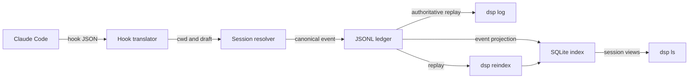

# Claude Code integration

Claude Code is Dispatch's only implemented structured hook provider. Hooks translate
Claude lifecycle and tool events into the current Dispatch session's append-only ledger.
They observe activity; they do not launch Claude or authorize its actions.

## Install at user scope

```powershell
dsp hooks install claude
```

On Windows, the installer updates `%USERPROFILE%\.claude\settings.json` idempotently and
preserves existing settings. A compiled binary registers its own absolute executable
path using Claude Code's shell-free exec form, so spaces are safe and `dsp` does not need
to be on `PATH` for hook invocation.

Keep the installed executable at that path. User scope is deliberate: future Dispatch
worktrees inherit the hook without per-worktree setup.

## Install for one project

```powershell
dsp hooks install claude --project D:\github\repository
```

Project scope writes `D:\github\repository\.claude\settings.local.json`. It affects only
that project and is not inherited by future Dispatch worktrees.

## Test a source checkout

The provider hook needs a compiled executable path. Build first, then make that path
explicit:

```powershell
bun run build
bun run dsp -- hooks install claude --command D:\absolute\path\to\dispatch\dist\dsp.exe
```

A `.cmd` or `.bat` shim is not a valid shell-free Claude hook target.

## Verify captured events

Create a Dispatch session, run Claude Code inside its returned worktree, then inspect the
ledger:

```powershell
dsp log <sid>
```

The hook resolves Claude's cwd against Dispatch session metadata. Valid events outside a
Dispatch-owned worktree return without recording anything.



## Data boundary

The translator records provider correlation fields under `ext.claude`. It does not store
prompt bodies, command bodies, tool responses, assistant messages, or transcript
contents. For unknown future payloads, it retains field names and value types—not unknown
values.

Hooks are recorded at least once. Provider correlation identifiers are retained for
diagnosis, but cross-process semantic deduplication is not implemented.

For the canonical event model, see the [architecture specification](../arch.md). For
exact live-process proof, see [Qualification evidence](qualification/README.md).
